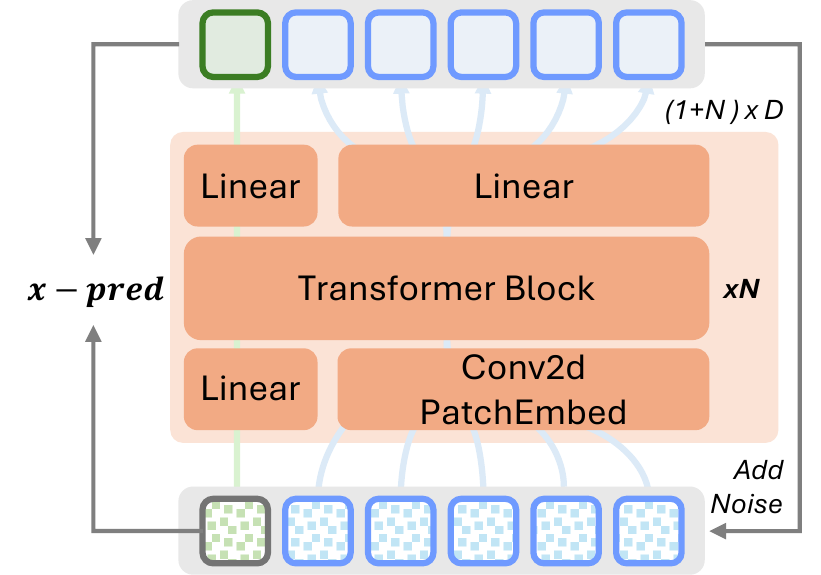
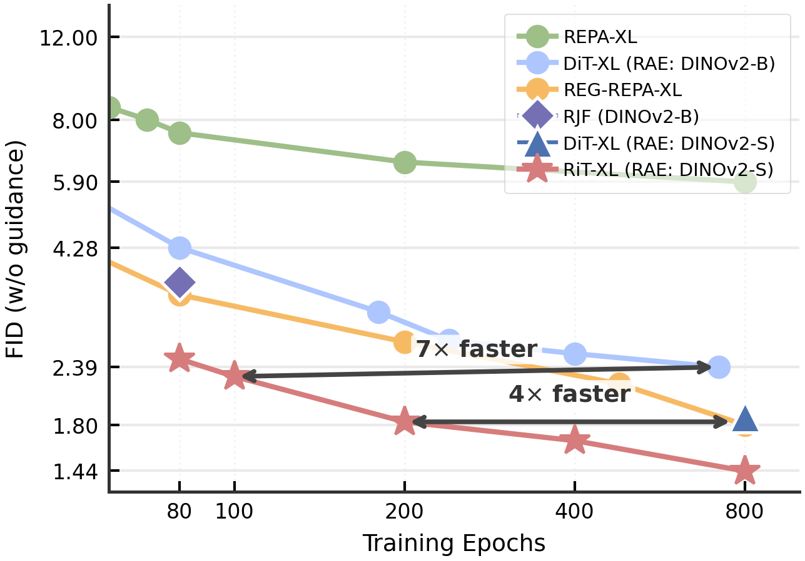
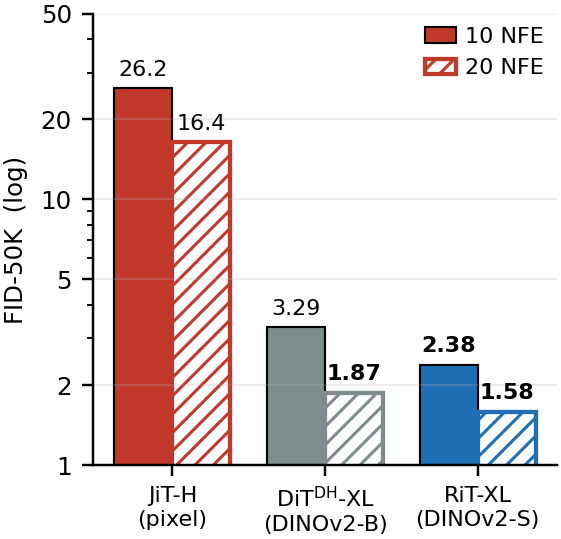
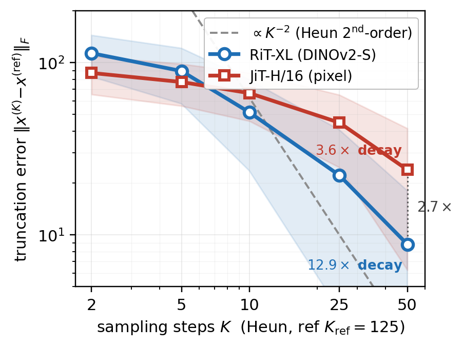

<div align="center">

# RiT: Vanilla Diffusion Transformers Are Enough in Representation Space

[](https://arxiv.org/) &nbsp;
[](https://huggingface.co/le723z/RiT) &nbsp;


**[Le Zhang](https://lezhang7.github.io/) &nbsp;·&nbsp; Ning Mang &nbsp;·&nbsp; Aishwarya Agrawal**

<p>
<a href="https://mila.quebec">Mila — Québec AI Institute, UdeM</a> &nbsp;·&nbsp;
Utrecht University &nbsp;·&nbsp; Canada CIFAR AI Chair
</p>


*Curated RiT-XL samples on ImageNet 256×256.*

</div>

---

## What is RiT?

RiT performs class-conditional image generation by **flow matching in the
frozen DINOv2 representation space**. A vanilla Diffusion Transformer trained
with **x-prediction** on **element-wise standardized** features, a
**dimension-aware noise schedule**, and a **joint [CLS]-patch** objective
reaches state-of-the-art FID on ImageNet 256×256 — with no DDT head, no
Riemannian reformulation, and no representation-alignment loss.

<div align="center">

</div>

> **Architecture.** Frozen DINOv2 encoder → element-wise standardize → vanilla
> DiT trained with x-prediction → denormalize → frozen ViT decoder. The
> projected [CLS] token is prepended to the patch sequence, attends jointly,
> and is predicted by a separate linear head.

---

## Results on ImageNet 256×256

RiT-XL uses the smallest DINOv2 variant (DINOv2-S, d=384) and 676M denoiser
parameters. All FIDs use 25 Heun steps with the time-shift schedule.

| Method                       | Encoder           | Params |     FID ↓ (CFG=1) |     FID ↓ (CFG≈3.7) |
|------------------------------|------------------:|-------:|------------------:|--------------------:|
| DiT-XL                       | SD-VAE            |  675M  | 9.62              | 2.27                |
| SiT-XL                       | SD-VAE            |  675M  | 8.61              | 2.06                |
| REPA-XL                      | SD-VAE            |  675M  | 5.78              | 1.29                |
| DDT-XL                       | SD-VAE            |  675M  | 6.27              | 1.26                |
| REG-XL                       | SD-VAE            |  675M  | 1.80              | 1.36                |
| RAE-XL                       | DINOv2-S          |  676M  | 1.87              | 1.41                |
| RAE-XL<sup>DH</sup>          | DINOv2-B          |  839M  | 1.51              | 1.16                |
| FAE-XL                       | FAE-DINOv2-G      |  675M  | 1.48              | 1.29                |
| **RiT-XL (ours)**            | **DINOv2-S**      | **676M** | **1.45**        | **1.14**            |

**Convergence is ~7× faster than RAE at matched encoder.** RiT-XL matches RAE's
800-epoch FID within ~100 epochs.

<div align="center">

</div>

**Few-step generation works out of the box** — no distillation, no consistency
training. With the time-shift schedule:

| Heun steps     |  5   | 10   | 25   | 50   |
|---------------:|-----:|-----:|-----:|-----:|
| FID (CFG=1.0)  | 2.44 | 1.59 | 1.47 | 1.46 |
| FID (CFG=3.7)  | 1.99 | 1.27 | 1.15 | 1.15 |

<div align="center">
 &nbsp;

</div>

> *Left:* Few-step FID at matched NFE — RiT clears 2.0 at 5 NFE while pixel-space
> JiT is at 26.2.
> *Right:* RiT's pixel-space truncation error decays 3.6× steeper than JiT's,
> consistent with a smoother velocity field over DINOv2 features.

---

## Installation

```bash
git clone https://github.com/lezhang7/RiT.git
cd RiT
# Install PyTorch matching your CUDA toolkit (12.8 example below)
pip install torch==2.9.1 torchvision==0.24.1 torchaudio==2.9.1 \
    --index-url https://download.pytorch.org/whl/cu128
pip install -r requirements.txt
```

The DINOv2-with-Registers encoder is loaded from HuggingFace on first use.
The RiT-XL checkpoint and the matching RAE decoder are also pulled from
HuggingFace automatically the first time you run `bash scripts/eval.sh`
(see [Quick start](#quick-start)). To prefetch them manually:

```bash
python scripts/download_assets.py            # decoder + RiT-XL ckpt
python scripts/download_assets.py --assets rae_decoder_base   # also DINOv2-Base decoder
```

This populates:
- `models/decoders/dinov2/wReg_small/ViTXL_n08/model.pt` — RAE decoder, from
  [`nyu-visionx/RAE-collections`](https://huggingface.co/nyu-visionx/RAE-collections).
- `output/rit_xl_dinov2s/checkpoint-last.pth` — released RiT-XL weights, from
  [`le723z/RiT`](https://huggingface.co/le723z/RiT).

### ImageNet data

Standard `ImageFolder` layout:

```
imagenet/
  train/n01440764/*.JPEG
  val/...
```

### What's already in the repo

- `stats/RAE_DINOv2_{small,base}/normalization_stats.pt` — element-wise
  standardization statistics for §3.1.
- `fid_stats/imagenet{256,512}_stats.npz` — Inception FID reference statistics
  used by `torch_fidelity` at evaluation time. No additional downloads needed.

---

## Quick start

### Train RiT-XL (reproduces FID 1.45 / 1.14)

```bash
bash scripts/train.sh
# or override paths:
OUTPUT_DIR=output/my_run IMAGENET_PATH=/data/imagenet bash scripts/train.sh
```

8 GPUs · batch 192/GPU (effective 1536) · 800 epochs. See `scripts/train.sh`
for the full command.

### Evaluate the released checkpoint

The first run downloads `le723z/RiT/checkpoint-last.pth` (RiT-XL, 800 epochs)
and the matching RAE decoder automatically — no manual setup:

```bash
# Guided (CFG=3.7 in [0.1, 0.98]):  FID ~1.14
bash scripts/eval.sh

# Unguided:                          FID ~1.45
CFG=1.0 bash scripts/eval.sh

# Few-step:                          10 Heun steps → FID ~1.27 guided
NUM_STEPS=10 bash scripts/eval.sh

# Evaluate your own checkpoint instead of the released one
CKPT=output/my_run/checkpoint-last.pth bash scripts/eval.sh
```

> **Note.** `bash scripts/eval.sh` runs in a fresh subshell and does **not**
> inherit `conda activate` from your terminal. If you hit
> `huggingface_hub not importable`, either activate your environment first or
> point the script at the right interpreter:
> ```bash
> PYTHON=/path/to/venv/bin/python TORCHRUN=/path/to/venv/bin/torchrun \
>     bash scripts/eval.sh
> ```

Reports FID / IS / Precision / Recall via [torch-fidelity](https://github.com/LTH14/torch-fidelity).

### Reconstruction demo

```bash
python sample_rae.py --image demo/pixabay_cat.png --rae_model RAE_DINOv2 --dinov2small
```

---

## Code layout

```
├── main.py              # Training / evaluation entry point
├── model.py             # RiT transformer backbone (adaLN, SwiGLU, RMSNorm, RoPE)
├── denoiser.py          # Flow-matching loss, time schedules, ODE samplers, CFG
├── engine.py            # Training loop, FID / IS / P-R computation
├── rae.py               # Frozen DINOv2 encoder + ViT decoder
├── rae_decoder.py       # GeneralDecoder implementation
├── calculate_stat.py    # Precompute normalization statistics
├── sample_rae.py        # Encoder-decoder reconstruction demo
├── decoder_config/      # DINOv2-S/B decoder configs (local)
├── stats/               # Precomputed normalization statistics
├── fid_stats/           # Inception FID reference statistics
├── scripts/             # train / eval / calc_stats shell scripts
└── util/
    ├── crop.py          # Center-cropping (ADM)
    ├── lr_sched.py      # Constant + cosine LR schedules
    ├── model_util.py    # VisionRoPE, sin-cos pos embed, RMSNorm
    ├── mae_utils.py     # ViTMAEConfig helpers for the decoder
    └── misc.py          # Distributed training, checkpointing, logging
```

---

## Citation

If you find RiT useful, please cite:

```bibtex
@article{zhang2025rit,
  title  = {RiT: Vanilla Diffusion Transformers Are Enough in Representation Space},
  author = {Zhang, Le and Mang, Ning and Agrawal, Aishwarya},
  year   = {2025}
}
```

---

## Acknowledgments

This codebase builds directly on:

- **JiT** — [LTH14/JiT](https://github.com/LTH14/JiT): x-prediction flow
  matching in pixel space, in-context class tokens, and the modernized DiT
  block design (SwiGLU, RMSNorm, QK-norm, RoPE).
- **RAE** — [bytetriper/RAE](https://github.com/bytetriper/RAE): the
  frozen DINOv2 encoder + ViT decoder pairing for representation-space
  diffusion.

We also thank the authors of DiT, SiT, LightningDiT, REPA, REG, DDT, and
torch-fidelity for the tooling and design choices we relied on. Full citations
are in the paper.
